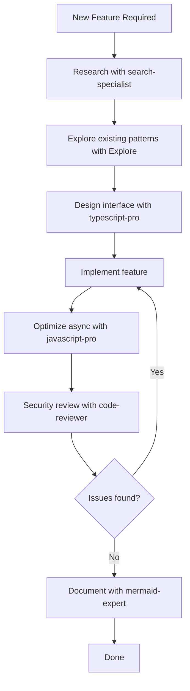
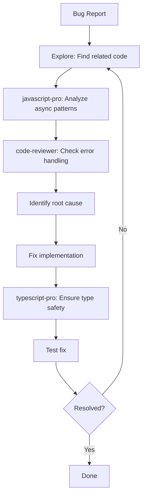
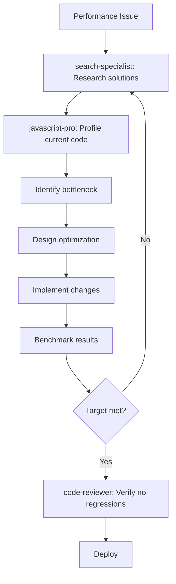

# VideoSum - AI Agent Strategy Guide

**Purpose**: Leverage specialized AI agents to reduce bugs, improve code quality, and accelerate development
**Last Updated**: October 16, 2025

---

## Table of Contents
1. [Overview](#overview)
2. [Agent Roster](#agent-roster)
3. [Context Scoping Strategy](#context-scoping-strategy)
4. [Agent Usage by Development Phase](#agent-usage-by-development-phase)
5. [Practical Workflows](#practical-workflows)
6. [Best Practices](#best-practices)
7. [Quick Reference](#quick-reference)

---

## 1. Overview

### Why Use Specialized Agents?

Traditional development approaches often lead to:
- ❌ Security vulnerabilities discovered after deployment
- ❌ Type errors that slip through to production
- ❌ Performance issues found during load testing
- ❌ Breaking changes when refactoring
- ❌ Inconsistent error handling across modules

### Agent-Assisted Development Benefits:

- ✅ **Proactive Code Review**: Catch bugs before they become issues
- ✅ **Type Safety**: Eliminate runtime type errors with expert TypeScript design
- ✅ **Security First**: Continuous security audits during development
- ✅ **Optimized Performance**: Expert async patterns and resource management
- ✅ **Informed Decisions**: Latest API research and best practices
- ✅ **Visual Documentation**: Auto-generated diagrams for complex flows

### Core Principle: **Scoped Context**

Instead of giving agents the entire codebase, provide **focused, scoped contexts**:
- 5-10 related files
- Specific module or feature
- Clear boundaries and responsibilities

This results in:
- Faster, more accurate analysis
- Fewer false positives
- Deeper insights into specific areas
- Better actionable recommendations

---

## 2. Agent Roster

### 🛡️ **code-reviewer** - Security & Quality Guardian

**Specialization**: Production-grade code analysis, security vulnerabilities, performance bottlenecks

**When to Use**:
- After implementing any feature module
- Before committing security-sensitive code (auth, file upload, API keys)
- After external API integrations
- Pre-deployment full codebase audit

**Key Capabilities**:
- SQL injection and XSS detection
- Authentication/authorization flow validation
- Resource leak identification (memory, file handles)
- Error handling completeness
- API security review (key exposure, rate limiting)

**Example Prompt**:
```
Review the authentication module for security vulnerabilities:

Context:
- /app/api/auth/[...nextauth]/route.ts
- /app/api/auth/signup/route.ts
- /lib/auth.ts
- Prisma User model

Check for:
1. JWT security (proper signing, expiration)
2. Password hashing (bcrypt with cost 12+)
3. SQL injection via Prisma
4. Missing rate limiting on auth endpoints
5. Session fixation vulnerabilities
6. Proper error messages (don't leak user existence)
```

---

### 🎯 **typescript-pro** - Type System Architect

**Specialization**: Advanced TypeScript patterns, type safety, strict type checking

**When to Use**:
- Designing core domain interfaces
- Creating type-safe API wrappers
- Implementing discriminated unions for complex states
- Refactoring to eliminate `any` types
- Setting up strict type checking for new modules

**Key Capabilities**:
- Discriminated union design
- Generic type constraints
- Type-safe API clients
- Branded types for domain modeling
- Utility type creation

**Example Prompt**:
```
Design a type-safe video processing pipeline:

Requirements:
1. VideoSource as discriminated union (upload, zoom, youtube, meet, vimeo)
2. Each source has specific metadata (meetingId for Zoom, videoId for YouTube)
3. TranscriptExtractor interface that's source-aware
4. ProcessingResult with typed errors per stage
5. Type-safe job queue payloads

Ensure:
- Compiler enforces all cases handled in switch statements
- No `any` types
- Proper error type narrowing
- Type inference for async operations
```

---

### 🔍 **Explore** - Codebase Navigator & Impact Analyzer

**Specialization**: Finding files, tracing code flows, dependency analysis, pattern detection

**When to Use**:
- Before refactoring (understand impact)
- When debugging cross-module issues
- Finding all usages of a pattern
- Understanding unfamiliar codebase areas
- Locating error handling gaps

**Key Capabilities**:
- Pattern-based file search (glob patterns)
- Code flow tracing (function call chains)
- Dependency mapping
- Finding anti-patterns
- Usage analysis

**Thoroughness Levels**:
- **quick**: Basic pattern matching (use for simple lookups)
- **medium**: Moderate exploration (default, good for features)
- **very thorough**: Comprehensive analysis (for critical refactors)

**Example Prompt**:
```
Before adding speaker diarization to transcripts, explore:

Thoroughness: medium

Questions:
1. Where is the Transcript model currently used?
2. What components display transcript data?
3. How are transcripts currently parsed and stored?
4. Are there existing speaker-related fields or logic?
5. What would break if I add a 'speakers' JSON field?

Provide:
- List of affected files
- Current data flow diagram
- Potential breaking changes
```

---

### ⚡ **javascript-pro** - Async & Performance Expert

**Specialization**: Modern JavaScript, async patterns, Node.js APIs, performance optimization

**When to Use**:
- Implementing job queue workers
- Optimizing video processing (FFmpeg, streams)
- Handling concurrent operations
- Fixing memory leaks
- Managing backpressure in streams
- Implementing retry logic with exponential backoff

**Key Capabilities**:
- Async/await optimization
- Stream processing (Node.js streams)
- Event loop understanding
- Memory management
- Concurrent operation design
- Error propagation in async chains

**Example Prompt**:
```
Optimize the frame extraction worker:

Context: /lib/video/frame-extractor.ts

Current issues:
- Processes videos sequentially (slow)
- Loads entire video into memory (crashes on large files)
- No cleanup if process crashes mid-extraction

Requirements:
1. Process frames in parallel (pool of 5 workers)
2. Stream-based processing to avoid memory issues
3. Guarantee cleanup even on crash (temp files deleted)
4. Backpressure handling if storage API is slow
5. Graceful shutdown (finish current frame, reject new jobs)

Provide:
- Optimized implementation
- Error handling strategy
- Resource cleanup guarantees
```

---

### 🔬 **search-specialist** - Research & Integration Expert

**Specialization**: Web research, API documentation, best practices, cost comparisons

**When to Use**:
- Before integrating new APIs (Zoom, YouTube, Deepgram)
- Comparing service providers (AI models, transcription services)
- Finding latest best practices
- Researching error codes from external services
- Staying current with API changes

**Key Capabilities**:
- Advanced search operators
- API documentation synthesis
- Multi-source verification
- Cost comparison analysis
- Trend analysis

**Example Prompt**:
```
Research Zoom Cloud Recording API for transcript extraction:

Focus areas:
1. Authentication: OAuth 2.0 flow for server-to-server
2. Endpoints: Which API to get transcripts for past meetings?
3. Transcript formats: VTT, SRT, or JSON?
4. Limitations: Rate limits, quotas, availability delays
5. Error handling: Common errors and retry strategies
6. Costs: Any API usage fees?
7. Code examples: Node.js/TypeScript if available

Target: 2025 documentation and best practices
Provide: Concrete implementation guidance with examples
```

---

### 📊 **mermaid-expert** - Visual Documentation Specialist

**Specialization**: Mermaid diagram creation (flowcharts, sequences, ERDs, state machines)

**When to Use**:
- Documenting complex flows (video processing pipeline)
- Visualizing state machines (video status transitions)
- Creating sequence diagrams (API interactions)
- Designing architecture diagrams
- Onboarding documentation

**Key Capabilities**:
- Flowcharts for decision logic
- Sequence diagrams for API interactions
- State diagrams for status flows
- ERD for database schema
- Architecture diagrams

**Example Prompt**:
```
Create a Mermaid sequence diagram for Zoom URL processing:

Flow:
1. User submits Zoom recording URL
2. System parses URL, extracts meeting ID
3. Authenticate with Zoom OAuth (server-to-server)
4. Request recording metadata
5. Check if transcript available
6. If yes: Download transcript
7. If no: Fall back to Deepgram (extract audio first)
8. Parse transcript to standard format
9. Store in database

Include:
- Error paths (auth failure, transcript unavailable, network errors)
- Retry logic
- Timeout handling
- Success/failure responses

Based on: /lib/transcript/zoom.ts implementation
```

---

## 3. Context Scoping Strategy

### The Golden Rule: **One Module, One Context**

❌ **Bad**: "Review the entire codebase for security issues"
✅ **Good**: "Review authentication module (/app/api/auth/**, /lib/auth.ts) for security issues"

### Scoping by Development Phase

#### **Phase 0-1: Setup & Infrastructure**
```
Module: Authentication
├─ Scope: /app/api/auth/**, /lib/auth.ts, User model
├─ Agents: code-reviewer (security), typescript-pro (types)
└─ Focus: JWT handling, password hashing, session management

Module: File Upload
├─ Scope: /app/api/videos/upload, /components/upload/**
├─ Agents: code-reviewer (validation), javascript-pro (streaming)
└─ Focus: File validation, upload progress, error handling

Module: Database
├─ Scope: /prisma/schema.prisma, /lib/db.ts
├─ Agents: typescript-pro (Prisma types), code-reviewer (query safety)
└─ Focus: Schema design, relationship integrity, query optimization
```

#### **Phase 2: Video Processing**
```
Module: Transcript Extraction
├─ Scope: /lib/transcript/**, platform-specific handlers
├─ Agents: search-specialist (APIs), typescript-pro (interfaces)
└─ Focus: Platform integration, error handling, rate limiting

Module: Frame Extraction
├─ Scope: /lib/video/frame-extractor.ts, FFmpeg utils
├─ Agents: javascript-pro (streams), code-reviewer (cleanup)
└─ Focus: Memory management, parallel processing, temp file cleanup

Module: Job Queue
├─ Scope: /lib/queue/**, worker processes
├─ Agents: javascript-pro (async), typescript-pro (job types)
└─ Focus: Concurrency, retries, graceful shutdown
```

#### **Phase 3: AI Integration**
```
Module: OpenAI Integration
├─ Scope: /lib/ai/openai.ts, prompt templates
├─ Agents: code-reviewer (API keys), search-specialist (models)
└─ Focus: Key security, cost tracking, error handling

Module: Visual Analysis
├─ Scope: /lib/ai/vision.ts, frame analysis
├─ Agents: javascript-pro (batch processing), code-reviewer (costs)
└─ Focus: Batch optimization, rate limiting, result parsing

Module: Markdown Generation
├─ Scope: /lib/markdown/generator.ts, templates
├─ Agents: typescript-pro (template types), code-reviewer (XSS)
└─ Focus: Template safety, image embedding, sanitization
```

### Scoping Patterns

#### **Pattern 1: Feature Boundary**
```
Feature: Add Vimeo Support
├─ Research: search-specialist → Vimeo API docs
├─ Explore: Explore agent → Find YouTube implementation
├─ Design: typescript-pro → Type-safe Vimeo extractor
├─ Implement: javascript-pro → Async error handling
├─ Review: code-reviewer → Security audit
└─ Document: mermaid-expert → Integration flow diagram
```

#### **Pattern 2: Refactoring Safety**
```
Before Refactoring: Extract audio to separate module
├─ Step 1: Explore → Find all audio extraction code
├─ Step 2: Explore → Find all callers of audio extraction
├─ Step 3: typescript-pro → Design new AudioExtractor interface
├─ Step 4: code-reviewer → Review proposed interface
├─ Step 5: Implement refactor
└─ Step 6: code-reviewer → Verify no regressions
```

#### **Pattern 3: Performance Optimization**
```
Optimize: Frame extraction is too slow
├─ Step 1: Explore → Find frame extraction code
├─ Step 2: search-specialist → Research FFmpeg optimization
├─ Step 3: javascript-pro → Implement parallel processing
├─ Step 4: code-reviewer → Check for memory leaks
└─ Step 5: Benchmark and validate
```

---

## 4. Agent Usage by Development Phase

### 📅 **Week 1: Project Setup**

#### Day 1-2: Next.js + Database Setup
```bash
# Agent: typescript-pro
"Review my Prisma schema for:
- Proper relationship modeling (User → Video → Transcript)
- Index optimization (queries by userId, status, createdAt)
- Type safety (ensure Prisma types are strict)
Context: /prisma/schema.prisma"

# Agent: code-reviewer
"Review database connection setup for:
- Connection pooling configuration
- Proper connection cleanup
- Error handling on connection failures
Context: /lib/db.ts"
```

#### Day 3-4: Authentication
```bash
# Agent: search-specialist
"Research NextAuth.js v5 best practices for 2025:
- App Router integration
- JWT vs database sessions (trade-offs)
- CSRF protection
- Refresh token rotation
Provide: Implementation examples"

# Agent: typescript-pro
"Design type-safe NextAuth configuration:
- Proper session type augmentation
- Type-safe callbacks (jwt, session)
- Provider configuration types
Context: /lib/auth.ts"

# Agent: code-reviewer
"Security audit of authentication system:
- Password hashing (bcrypt cost factor)
- JWT signing and validation
- Session fixation prevention
- Timing attack prevention in password comparison
Context: /app/api/auth/**, /lib/auth.ts"
```

#### Day 5: File Upload
```bash
# Agent: code-reviewer
"Review file upload for security:
- File type validation (whitelist, not blacklist)
- File size limits (prevent DoS)
- Filename sanitization (path traversal prevention)
- MIME type verification (not just extension)
Context: /app/api/videos/upload/route.ts"

# Agent: javascript-pro
"Optimize large file upload handling:
- Streaming upload (avoid loading in memory)
- Progress reporting
- Resumable uploads (optional)
- Error recovery
Context: /app/api/videos/upload/route.ts"
```

---

### 📅 **Week 2-3: Core Features**

#### Video Management
```bash
# Agent: Explore (quick)
"Find all places where video status is checked or updated:
- API routes
- Database queries
- Frontend components
Show me the current status flow"

# Agent: typescript-pro
"Create a type-safe video status enum:
- Define all possible statuses
- Create helper functions (isProcessing, isComplete, isFailed)
- Ensure exhaustive switch statements
Context: /lib/types/video.ts"
```

#### URL-Based Input
```bash
# Agent: search-specialist
"Research URL parsing for video platforms:
- Zoom: Extract meeting ID from various URL formats
- YouTube: Handle youtu.be and youtube.com/watch?v=
- Google Meet: Parse Google Drive URLs
Provide: Regex patterns or parsing libraries (Node.js)"

# Agent: typescript-pro
"Design platform detection system:
- Discriminated union for platforms
- Type-safe URL validator for each platform
- Extract metadata (videoId, meetingId) with types
Context: /lib/platform-detector.ts"

# Agent: code-reviewer
"Review URL processing for security:
- SSRF prevention (Server-Side Request Forgery)
- URL validation (reject malicious protocols)
- Sanitization before storage
Context: /app/api/videos/from-url/route.ts"
```

---

### 📅 **Week 4-6: Video Processing Pipeline**

#### Transcript Extraction
```bash
# Agent: search-specialist
"Deep dive into Zoom Cloud Recording API 2025:
- OAuth 2.0 server-to-server flow
- GET /meetings/{meetingId}/recordings endpoint
- Transcript file location in response
- Error codes and retry strategies
- Rate limits (requests per day/hour)
Provide: Working Node.js code example with error handling"

# Agent: Explore (medium)
"Show me the YouTube transcript extractor implementation:
- How it's structured
- Error handling patterns
- Integration with main pipeline
- Type definitions
Use this as template for Zoom extractor"

# Agent: typescript-pro
"Design unified TranscriptExtractor interface:
interface TranscriptExtractor {
  platform: Platform
  validate(url: string): boolean
  extract(url: string): Promise<TranscriptResult>
}

Create implementations for: Zoom, YouTube, Meet, Vimeo
Ensure: Type-safe error handling, platform-specific metadata"

# Agent: javascript-pro
"Review Zoom extractor async patterns:
- Proper OAuth token refresh (before expiration)
- Retry with exponential backoff (transient failures)
- Timeout handling (API takes too long)
- Parallel processing (if fetching multiple recordings)
Context: /lib/transcript/zoom.ts"

# Agent: code-reviewer
"Security audit of transcript extractors:
- OAuth tokens stored securely (environment variables)
- No tokens in logs or error messages
- User-provided URLs validated before API calls
- API responses sanitized before storage
Context: /lib/transcript/**"
```

#### Frame Extraction
```bash
# Agent: search-specialist
"Research FFmpeg for presentation video frame extraction:
- Scene detection filters for slide transitions
- Optimal settings for 1080p presentation videos
- Extracting frames at scene changes vs fixed intervals
- Minimizing output file size while preserving text clarity
- Node.js libraries: fluent-ffmpeg vs direct spawn
Provide: Command examples and best practices"

# Agent: javascript-pro
"Implement streaming frame extraction:
Requirements:
- Don't load entire video into memory
- Process frames as they're extracted
- Upload frames to blob storage in parallel
- Handle backpressure (storage slower than extraction)
- Cleanup temp files even if process crashes
Context: /lib/video/frame-extractor.ts"

# Agent: code-reviewer
"Review frame extraction for resource leaks:
- FFmpeg process cleanup (even on errors)
- Temp file deletion guaranteed
- Memory usage with large videos
- File handle limits (don't open too many)
Context: /lib/video/frame-extractor.ts"

# Agent: mermaid-expert
"Create flowchart for frame extraction process:
1. Download video (if URL-based)
2. Run FFmpeg scene detection
3. Extract frames at scene changes
4. Upload to Vercel Blob (parallel)
5. Create Frame records in database
6. Cleanup temp files
Include error paths and retry logic"
```

#### Job Queue System
```bash
# Agent: search-specialist
"Research BullMQ best practices 2025:
- Worker concurrency settings
- Job retry strategies (exponential backoff)
- Graceful shutdown (wait for jobs to finish)
- Job priority and rate limiting
- Monitoring and metrics
Provide: Production-ready worker setup example"

# Agent: typescript-pro
"Design type-safe job queue system:
- Discriminated union for job types (transcript, frames, analysis)
- Typed payloads for each job type
- Type-safe progress updates
- Typed error results

Ensure:
- addJob() enforces correct payload for job type
- Worker handlers are type-checked
- No 'any' in job definitions"

# Agent: javascript-pro
"Review video processing worker:
- Handles 10 concurrent jobs without memory issues
- Proper error handling (retry transient, fail permanent)
- Progress updates (25%, 50%, 75%, 100%)
- Graceful shutdown (finish current, reject new)
- Database connection pooling
Context: /lib/queue/video-worker.ts"

# Agent: code-reviewer
"Audit job queue for reliability:
- Jobs are idempotent (can retry safely)
- No data loss if worker crashes
- Orphaned jobs are detected and retried
- Failed jobs have useful error messages
Context: /lib/queue/**"
```

---

### 📅 **Week 7-8: AI Integration**

#### OpenAI Integration
```bash
# Agent: search-specialist
"Compare OpenAI GPT-4o mini vs Gemini 1.5 Flash for VideoSum:
- Cost per token (input and output)
- Context window (can it handle 1-hour transcripts?)
- Multimodal capabilities (analyzing screenshots)
- API rate limits
- Response quality for meeting summarization
- Latency (p50, p95)
Focus: 2025 pricing and real-world benchmarks"

# Agent: code-reviewer
"Security review of OpenAI integration:
- API key stored in environment variables (not hardcoded)
- API key never logged or sent to client
- User input sanitized (prevent prompt injection)
- Cost tracking per request (prevent abuse)
- Rate limiting to prevent API bill shock
Context: /lib/ai/openai.ts"

# Agent: javascript-pro
"Optimize AI API calls:
- Batch multiple frames into single request (reduce costs)
- Implement retry with exponential backoff (rate limits)
- Timeout handling (requests >30s)
- Stream responses for long summaries (better UX)
- Token counting before sending (prevent over-limit errors)
Context: /lib/ai/openai.ts"

# Agent: typescript-pro
"Design type-safe OpenAI wrapper:
- Typed request/response for each operation (summarize, analyze frame)
- Typed error results (rate limit, timeout, invalid response)
- Type-safe token counting
- Proper async return types

Ensure: No 'any' types, full type inference"
```

#### Visual Analysis
```bash
# Agent: search-specialist
"Research best practices for identifying slides in videos:
- Computer vision approaches (OpenCV)
- Using AI (GPT-4o vision) vs traditional CV
- Distinguishing slides from speaker view
- OCR accuracy for presentation text
- Cost optimization strategies
Provide: Recommended approach for our use case"

# Agent: javascript-pro
"Optimize frame analysis batching:
- Process 10 frames in parallel (not sequential)
- Implement queue to avoid rate limiting (GPT-4o: 60 req/min)
- Smart batching (group similar frames to reduce API calls)
- Cache results to avoid re-analyzing identical frames
Context: /lib/ai/vision.ts"

# Agent: code-reviewer
"Review visual analysis for quality:
- Frame deduplication (skip nearly identical frames)
- Confidence thresholds (only store high-quality results)
- Error handling (API fails for some frames)
- Cost tracking (per-frame cost calculation)
Context: /lib/ai/vision.ts"
```

#### Markdown Generation
```bash
# Agent: typescript-pro
"Design Markdown template system:
- MarkdownTemplate interface
- Built-in templates (detailed, brief, technical)
- Custom template support
- Type-safe template variables
- Template validation

Ensure: Compile-time safety for template rendering"

# Agent: code-reviewer
"Security review of Markdown generation:
- XSS prevention (sanitize user-generated content)
- Injection attacks via transcript text
- Image URL validation (embedded frames)
- No script tags in output
- Safe HTML rendering on client
Context: /lib/markdown/generator.ts"

# Agent: mermaid-expert
"Create sequence diagram for AI summarization:
1. Transcript received
2. Split into chunks (if >8k tokens)
3. Send to GPT-4o mini (parallel for chunks)
4. Receive summaries
5. Combine summaries
6. Extract key points and action items
7. Analyze frames (parallel)
8. Generate final Markdown
9. Store Summary record
Include: Error handling, retry logic, progress updates"
```

---

### 📅 **Week 9-10: Polish & Launch**

#### Pre-Deployment Audit
```bash
# Agent: Explore (very thorough)
"Find all async functions without error handling:
- Missing try-catch blocks
- Unhandled promise rejections
- .catch() not called on promises
Scope: /app/api/**, /lib/**"

# Agent: code-reviewer
"Full codebase security audit:
Priority areas:
1. Authentication and authorization
2. File upload and validation
3. API key management
4. User input sanitization
5. SQL injection prevention
6. Rate limiting implementation
7. Error messages (no info leakage)

Provide: Categorized findings (critical, high, medium, low)"

# Agent: typescript-pro
"Type safety audit:
- Find all 'any' types (goal: zero)
- Find all type assertions (as, !) - verify necessary
- Check for proper null/undefined handling
- Ensure exhaustive switch statements
- Verify async return types are properly awaited

Provide: List of type safety improvements"

# Agent: javascript-pro
"Performance audit:
- Find N+1 database queries
- Identify blocking synchronous operations
- Check for memory leaks (unclosed streams, event listeners)
- Verify proper resource cleanup (finally blocks)
- Analyze bundle size (heavy dependencies)

Provide: Optimization recommendations"
```

#### Load Testing Preparation
```bash
# Agent: search-specialist
"Research load testing for Next.js applications:
- Tools: k6, Artillery, or autocannon
- Testing API routes (video upload, processing status)
- Simulating concurrent job processing
- Database connection pool sizing
- Monitoring during load tests (APM tools)
Provide: Load testing strategy and scripts"

# Agent: javascript-pro
"Optimize for concurrent processing:
Review:
- Can handle 50 concurrent video uploads?
- Worker processes 10 videos in parallel?
- Database connection pool properly sized?
- Redis connection handling (BullMQ)
- Memory usage under load (no leaks)

Provide: Concurrency configuration recommendations"
```

---

## 5. Practical Workflows

### Workflow 1: **Adding a New Platform (Vimeo)**

#### Step 1: Research
```bash
Agent: search-specialist
Prompt: "Research Vimeo API for transcript extraction:
- Authentication (API token vs OAuth)
- Endpoint for video captions/transcripts
- Supported formats (VTT, SRT)
- Rate limits and costs
- Example Node.js code
Target: 2025 documentation"

Deliverable: Implementation plan with API details
```

#### Step 2: Explore Existing Pattern
```bash
Agent: Explore
Thoroughness: medium
Prompt: "Show me how YouTube transcript extraction works:
- File location (/lib/transcript/youtube.ts)
- Type definitions
- Error handling patterns
- Integration with main pipeline
- Testing approach

Provide: Code structure overview to replicate for Vimeo"

Deliverable: Template to follow
```

#### Step 3: Design Interface
```bash
Agent: typescript-pro
Prompt: "Design VimeoTranscriptExtractor:
- Implements TranscriptExtractor interface
- Type-safe configuration (API token)
- Proper error types (auth failure, no transcript, rate limit)
- Return standardized Transcript type

Show: Interface definition and key method signatures"

Deliverable: Type-safe interface design
```

#### Step 4: Implement
```typescript
// Implement based on agent guidance
// /lib/transcript/vimeo.ts

export class VimeoTranscriptExtractor implements TranscriptExtractor {
  platform = 'vimeo' as const

  async extract(url: string): Promise<TranscriptResult> {
    // Implementation following youtube.ts pattern
  }
}
```

#### Step 5: Async Optimization
```bash
Agent: javascript-pro
Prompt: "Review Vimeo extractor implementation:
[Paste code]

Check:
- Proper async/await error handling
- Retry logic for transient failures (network errors)
- Timeout handling (API slow to respond)
- Token validation before API call
- Proper logging for debugging

Provide: Improved implementation"

Deliverable: Optimized code
```

#### Step 6: Security Review
```bash
Agent: code-reviewer
Prompt: "Security audit of Vimeo integration:
Context: /lib/transcript/vimeo.ts, /app/api/videos/from-url

Check:
- API token stored in env variables (not hardcoded)
- User URLs validated (prevent SSRF)
- No sensitive data in error messages
- Rate limiting respected
- Sanitize API responses before storage

Provide: Security issues and fixes"

Deliverable: Security checklist
```

#### Step 7: Test Integration
```bash
# Write tests based on youtube.test.ts pattern
# Test: URL validation, successful extraction, error cases
```

#### Step 8: Document Flow
```bash
Agent: mermaid-expert
Prompt: "Create sequence diagram for Vimeo transcript extraction:
1. User submits Vimeo URL
2. Validate URL format
3. Extract video ID
4. Authenticate with Vimeo API
5. Request caption/transcript
6. If available: Download and parse
7. If not: Return fallback signal (use Deepgram)
8. Store transcript in database

Include: Error paths, retry logic"

Deliverable: Visual documentation
```

---

### Workflow 2: **Debugging a Production Issue**

#### Scenario: "Some videos fail processing with unclear errors"

#### Step 1: Explore Error Patterns
```bash
Agent: Explore
Thoroughness: medium
Prompt: "Find all error handling in video processing pipeline:
- Where errors are caught
- How errors are logged
- Where error messages are stored (database)
- What information is included in errors

Scope: /lib/queue/video-worker.ts, /lib/transcript/**, /lib/video/**"

Deliverable: Error handling map
```

#### Step 2: Analyze Logs
```bash
# Review production logs
# Identify common error patterns
# Note: missing stack traces, vague messages
```

#### Step 3: Improve Error Handling
```bash
Agent: javascript-pro
Prompt: "Improve error handling in video processing worker:
Current issues:
- Generic errors ('Processing failed')
- No stack traces in production
- Unclear which stage failed (transcript? frames? AI?)

Add:
- Stage-specific error messages
- Preserve error stack traces
- Log context (videoId, sourceType, timestamp)
- Structured logging (JSON format)

Context: /lib/queue/video-worker.ts"

Deliverable: Enhanced error handling
```

#### Step 4: Add Instrumentation
```bash
Agent: code-reviewer
Prompt: "Review error instrumentation:
Ensure:
- All async operations have try-catch
- Errors include videoId for debugging
- No sensitive data in error messages
- Errors stored in database for user visibility
- Monitoring hooks (Sentry, etc.) integration

Context: /lib/queue/**, /lib/transcript/**"

Deliverable: Complete error coverage
```

#### Step 5: Test Error Scenarios
```typescript
// Write tests for:
// - Invalid video URLs
// - Transcript not available
// - API rate limiting
// - Network timeouts
// - Invalid video formats
```

---

### Workflow 3: **Performance Optimization**

#### Scenario: "Frame extraction is too slow for 1-hour videos"

#### Step 1: Research Best Practices
```bash
Agent: search-specialist
Prompt: "Research FFmpeg optimization for frame extraction:
- Fastest scene detection filters
- GPU acceleration options
- Multi-threaded processing
- Streaming vs full-file processing
- Benchmarks for 1080p videos

Focus: Extracting 50-100 frames from 1-hour video
Target: <5 minutes processing time"

Deliverable: Optimization strategies
```

#### Step 2: Analyze Current Implementation
```bash
Agent: javascript-pro
Prompt: "Profile current frame extraction:
Context: /lib/video/frame-extractor.ts

Analyze:
- Is FFmpeg running sequentially or parallel?
- Is video loaded into memory?
- Are frames uploaded synchronously?
- Are temp files cleaned up promptly?

Provide: Performance bottlenecks"

Deliverable: Bottleneck analysis
```

#### Step 3: Design Parallel Processing
```bash
Agent: typescript-pro
Prompt: "Design parallel frame extraction:
- Type-safe worker pool (N concurrent FFmpeg processes)
- Frame queue (extract → upload → database)
- Backpressure handling (pause if queue full)
- Resource limits (max memory, max workers)

Ensure: Type safety throughout pipeline"

Deliverable: Parallelization architecture
```

#### Step 4: Implement Optimization
```bash
Agent: javascript-pro
Prompt: "Implement parallel frame extraction:
[Paste design]

Requirements:
- Process 5 video sections in parallel
- Stream frames to storage (don't buffer all)
- Memory limit: 500MB per worker
- Graceful degradation (reduce workers if OOM)

Provide: Implementation with resource management"

Deliverable: Optimized code
```

#### Step 5: Verify No Regressions
```bash
Agent: code-reviewer
Prompt: "Review optimized frame extractor:
Check:
- No resource leaks (workers cleaned up)
- Error handling (worker crashes)
- Temp file cleanup (even on errors)
- Memory usage within limits
- Concurrent safety (race conditions)

Context: /lib/video/frame-extractor.ts"

Deliverable: Safety verification
```

#### Step 6: Benchmark
```bash
# Test with various video sizes:
# - 10 min, 720p
# - 30 min, 1080p
# - 60 min, 1080p

# Measure:
# - Processing time
# - Memory usage
# - CPU usage
# - Success rate
```

---

## 6. Best Practices

### ✅ DO: Use Agents Proactively

**Good Examples**:
```bash
# After implementing a feature
"I just finished the authentication system. Use code-reviewer to audit it."

# Before a refactor
"I'm about to refactor frame extraction. Use Explore to show me all dependencies."

# When stuck
"I'm getting TypeScript errors in the job queue. Use typescript-pro to fix the types."

# Before deployment
"Run a security audit on the entire API layer with code-reviewer."
```

### ❌ DON'T: Use Agents Reactively

**Bad Examples**:
```bash
# After production bug
"There's a security vulnerability in production. How do I fix it?"
→ Should have run code-reviewer before deployment

# After refactor breaks tests
"My refactor broke 20 tests. What did I change?"
→ Should have used Explore before refactoring

# After choosing wrong library
"This library doesn't support our use case. What should I use?"
→ Should have used search-specialist before choosing
```

### 🎯 Scoping Best Practices

#### ✅ Good Scoping
```bash
# Specific module with clear boundaries
"Review authentication module:
Context: /app/api/auth/**, /lib/auth.ts
Focus: JWT security, password hashing, session management"

# Feature with dependencies mapped
"Before adding speaker diarization, explore:
- Current Transcript model
- Components that display transcripts
- API routes that return transcripts"

# Targeted optimization
"Optimize frame extraction for 1-hour videos:
Context: /lib/video/frame-extractor.ts
Metrics: Currently 15min, target <5min"
```

#### ❌ Bad Scoping
```bash
# Too broad
"Review the entire codebase for bugs"
→ Scope: Entire codebase (overwhelming)

# No context
"Fix the types"
→ Which types? Where?

# Vague goal
"Make it faster"
→ What's slow? What's the target?
```

### 📝 Prompt Engineering for Agents

#### Structure Your Prompts

```markdown
## Good Prompt Template

**Objective**: [What do you want to achieve?]

**Context**:
- Files: [Specific files or directories]
- Current state: [What's implemented now]
- Problem: [What's wrong or missing]

**Requirements**:
1. [Specific requirement]
2. [Specific requirement]
3. [Specific requirement]

**Constraints**:
- [Any limitations or considerations]

**Deliverable**: [What should the agent provide?]
```

#### Example: Good vs Bad Prompts

**❌ Bad Prompt**:
```
"Review my code"
```
*Issues: No context, no scope, no specific focus*

**✅ Good Prompt**:
```
Review the video upload API for security vulnerabilities:

Context:
- File: /app/api/videos/upload/route.ts
- Current state: Accepts video uploads, stores in Vercel Blob
- Concern: Unsure if file validation is sufficient

Requirements:
1. Check file type validation (bypass attempts)
2. Verify file size limits (DoS prevention)
3. Review filename sanitization (path traversal)
4. Confirm MIME type checking (not just extension)

Constraints:
- Must support MP4, MOV, AVI, MKV
- Max file size: 2GB

Deliverable: List of vulnerabilities with severity and fixes
```

### 🔄 Iterative Refinement

Don't expect perfect results on first try. Iterate:

```bash
# Round 1: Initial design
Agent: typescript-pro
"Design a TranscriptExtractor interface"
→ Receives interface design

# Round 2: Refinement
Agent: typescript-pro
"The previous interface doesn't handle errors well.
Add typed errors for: auth failure, rate limit, not found, network error"
→ Receives improved design

# Round 3: Implementation validation
Agent: code-reviewer
"Review this implementation of TranscriptExtractor:
[Paste code]
Does it match the interface design? Any issues?"
→ Receives feedback
```

### 🧪 Test Agent Recommendations

Always validate agent suggestions:

```bash
# Agent suggests optimization
Agent: javascript-pro
"Use Promise.allSettled() instead of Promise.all() for frame extraction"

# Validate:
1. Write test comparing both approaches
2. Benchmark performance
3. Verify error handling
4. Check memory usage

# If validated: Adopt recommendation
# If not: Ask agent to refine or explain reasoning
```

### 📚 Document Agent Decisions

Keep a log of important agent-assisted decisions:

```markdown
## Architecture Decisions Log

### ADR-001: Use Discriminated Unions for Video Sources
**Date**: 2025-10-20
**Agent**: typescript-pro
**Decision**: Use discriminated unions instead of string literals
**Reasoning**: Compile-time safety, exhaustive checking
**Impact**: All video processing code must handle all source types
**Code**: /lib/types/video.ts

### ADR-002: Parallel Frame Extraction with Worker Pool
**Date**: 2025-10-22
**Agent**: javascript-pro
**Decision**: Process video sections in parallel (5 workers)
**Reasoning**: 3x speedup, memory stays under 500MB
**Impact**: Changed from sequential to parallel processing
**Code**: /lib/video/frame-extractor.ts
```

---

## 7. Quick Reference

### 🚀 Quick Agent Selector

| Task | Primary Agent | Secondary | Prompt Template |
|------|--------------|-----------|-----------------|
| **Design interfaces** | typescript-pro | - | "Design type-safe interface for [feature]" |
| **Security review** | code-reviewer | - | "Security audit of [module]: Check [specific concerns]" |
| **Find dependencies** | Explore | - | "Before changing [X], show me all dependencies" |
| **Optimize async** | javascript-pro | code-reviewer | "Optimize [async operation] for [constraint]" |
| **Research API** | search-specialist | - | "Research [API] for [use case]: Focus on [areas]" |
| **Document flow** | mermaid-expert | - | "Create [diagram type] for [feature/flow]" |
| **Pre-commit review** | code-reviewer | typescript-pro | "Review [module] for quality and type safety" |
| **Pre-refactor** | Explore | typescript-pro | "Map impact of refactoring [X]" |
| **Performance issue** | javascript-pro | search-specialist | "Profile and optimize [slow operation]" |

### 🎯 Agent Invocation Examples

#### Quick Security Check
```bash
code-reviewer: "Quick security scan of new API route:
/app/api/videos/[id]/share/route.ts
Focus: Auth bypass, data leakage, rate limiting"
```

#### Type Safety Improvement
```bash
typescript-pro: "Eliminate 'any' types in:
/lib/transcript/platform-detector.ts
Replace with proper discriminated unions"
```

#### Impact Analysis
```bash
Explore (medium): "I'm changing the Video model schema.
Show me all code that reads/writes Video model.
Estimate: How many files will need updates?"
```

#### Async Debugging
```bash
javascript-pro: "Debug this promise chain:
[Paste code]
Why isn't error being caught? How to fix?"
```

#### API Research
```bash
search-specialist: "Quick lookup: Deepgram Nova-3 pricing per hour
Focus: 2025 current rates, any volume discounts?"
```

#### Visual Documentation
```bash
mermaid-expert: "Flowchart for video status transitions:
States: pending → processing → completed/failed
Based on /lib/types/video.ts"
```

### 📋 Pre-Deployment Checklist

Run these agents before deploying:

```bash
# 1. Security audit (critical)
code-reviewer: "Full security audit:
- Authentication flows
- API key management
- User input handling
- File uploads
Provide: Critical and high severity issues only"

# 2. Type safety (high)
typescript-pro: "Type safety audit:
- Find all 'any' types
- Check null/undefined handling
- Verify exhaustive switches
Provide: List to fix before deploy"

# 3. Error handling (high)
Explore (medium): "Find async functions without error handling:
Scope: /app/api/**, /lib/**
Provide: List of missing try-catch blocks"

# 4. Performance (medium)
javascript-pro: "Quick performance scan:
- N+1 queries
- Blocking operations in API routes
- Memory leaks (unclosed resources)
Provide: Top 3 issues to address"

# 5. Documentation (low)
mermaid-expert: "Generate architecture diagram:
- Main user flows (upload → process → summary)
- System components
- External dependencies
For: README.md"
```

---

## 8. Common Patterns

### Pattern: **Feature Development Cycle**



### Pattern: **Bug Investigation**



### Pattern: **Performance Optimization**



---

## 9. Troubleshooting

### Problem: "Agent response is too generic"

**Solution**: Provide more specific context

❌ **Too vague**:
```
"Review my authentication code"
```

✅ **Specific**:
```
"Review JWT implementation in /lib/auth.ts:
- Check token signing algorithm (should be RS256)
- Verify expiration is set (7 days)
- Ensure refresh token rotation
- Check for timing attacks in token comparison"
```

### Problem: "Agent suggests incorrect solution"

**Solutions**:
1. **Refine context**: Add more specific requirements
2. **Iterate**: Ask agent to explain reasoning, then refine
3. **Combine agents**: Use multiple agents for validation

Example:
```bash
# Agent 1: Initial design
typescript-pro: "Design error handling types"
→ Receives design

# Agent 2: Validate design
code-reviewer: "Review this error handling design:
[Paste design]
Check: Complete error coverage, no sensitive data leakage"
→ Validates or finds issues

# Agent 3: Implement correctly
javascript-pro: "Implement error handling based on this design:
[Paste validated design]
Ensure: All async operations covered"
```

### Problem: "Conflicting advice from different agents"

**Solution**: Use specialized expertise appropriately

Example conflict:
```
typescript-pro: "Use branded types for IDs"
javascript-pro: "Use plain strings for simplicity"
```

**Resolution approach**:
1. Understand trade-offs of each
2. Consider project context (MVP vs production)
3. Make informed decision
4. Document in ADR (Architecture Decision Record)

---

## 10. Success Metrics

Track agent effectiveness:

### Metrics to Monitor

```typescript
interface AgentMetrics {
  bugsPreventedByReview: number      // Bugs found by code-reviewer
  refactoringSafety: number           // Regressions avoided via Explore
  typeErrorsPrevented: number         // Type issues caught by typescript-pro
  performanceImprovements: number     // Optimizations from javascript-pro
  securityIssuesFound: number         // Vulnerabilities caught
  researchTimesSaved: number          // Hours saved by search-specialist
}
```

### Goals

- **Pre-deployment bugs**: Catch 80%+ before production
- **Type safety**: Maintain 0 `any` types in production code
- **Security**: Zero high/critical vulnerabilities at launch
- **Performance**: All API routes <500ms (p95)
- **Documentation**: All complex flows have diagrams

---

## Conclusion

Specialized agents are **development force multipliers** when used correctly:

✅ **Use scoped contexts** (5-10 files, specific module)
✅ **Be specific in prompts** (clear objective, requirements, deliverable)
✅ **Iterate on feedback** (refine until satisfactory)
✅ **Validate recommendations** (test before adopting)
✅ **Document decisions** (maintain ADR log)

By following this guide, you'll:
- 🐛 Catch bugs before they reach production
- 🔒 Build secure, robust systems
- ⚡ Optimize performance proactively
- 📚 Maintain comprehensive documentation
- 🚀 Ship faster with confidence

---

**Next Steps**:
1. Read through agent descriptions
2. Start with Phase 0 tasks from TODO.md
3. Use agents at each step as guided
4. Track metrics and refine process
5. Update this guide with learnings

**Questions?** Refer to specific agent sections or practical workflows above.
